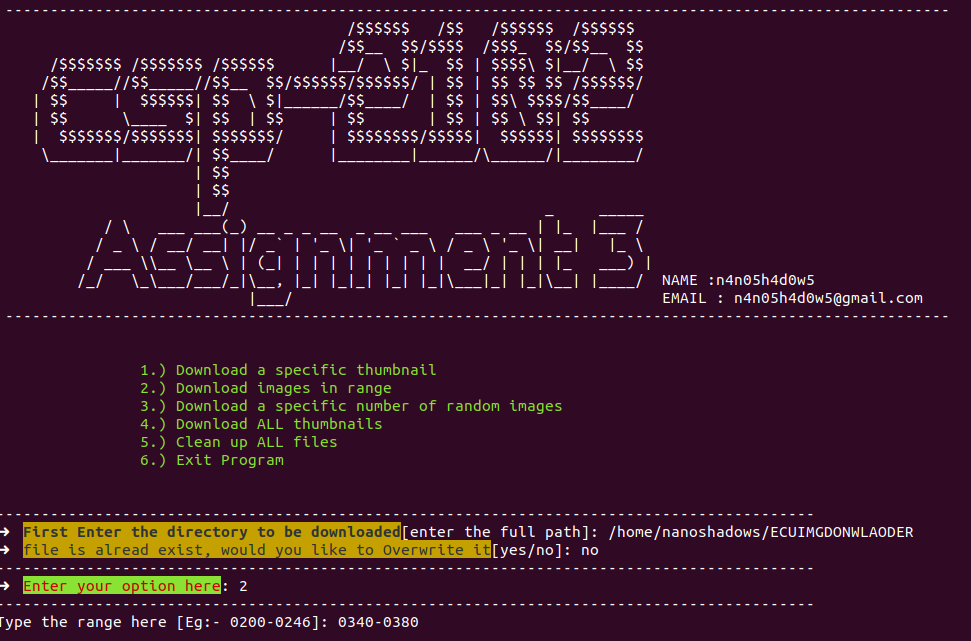

# ECU_Img_Downloader

This is one of the projects I did for the ECU CSP2101 Scripting Language unit.

The Task was to:

          Task Brief
          Your task is to write a script solution that displays the following functionality, reliability and quality elements:
          Solution Functionality
          Present the user with the following menu options, with the functionality to which option refers being facilitated by your script solution:
          1)	Download a specific thumbnail, i.e. 0231 (by the last 4 digits of the file name)
          2)	Download images in a range (by the last 4 digits of the file name), as an example, starting range of 0200 and ending range of 0231
          3)	Download a specified number of images, as an example, if the user enters the numeral 5, 5 random images in the specified range of DSC00200 to DSC00231 will be downloaded
          4)	Download ALL thumbnails
          5)	Clean up ALL files
          6)	Exit Program
          When the file or files are downloaded the output (assuming no errors) should report to screen the following;
          Downloading [image number], with the file name [filename and extension], with a file size of [file size and metric]
          As an example, if I selected to download DSC01566 the output would look like this;
          Downloading DSC00213, with the file name DSC00213.jpg, with a file size of 45.34 KB….File Download Complete
          For multiple files being downloaded, each file will be printed on its own line
          Downloading DSC00213, with the file name DSC00213.jpg, with a file size of 44.32 KB….File Download Complete
          Downloading DSC00219, with the file name DSC00219.jpg, with a file size of 48.39 KB….File Download Complete
          Downloading DSC00231, with the file name DSC00231.jpg, with a file size of 48.28 KB….File Download Complete
          When the user selects menu item 5) Clean up ALL files, all directories and files created by your script are to be deleted from the system, leaving nothing behind. 
          This means that your tutor’s working directory will be returned to its original state in preparation for the next student to be marked. Please note: this function will 
          be carefully perused before being executed, and if appears that it may delete anything other than the directory and files your script created, it will not be run and 
          no marks for this section will be awarded.
          Solution Reliability
          •	Each of the command line functions operates as specified
          •	User input errors are trapped and addressed so incorrect/invalid values are not accepted and processed by the script’s code
          •	The user is required to specify a directory into which all images are to be downloaded, and if that directory does not exist, it is to be created
          •	All files downloaded are to be successfully stored in the directory nominated by the user
          •	If a file to be downloaded is already present in the nominated directory, the user is to be given the choice to overwrite it or skip that file completely
          •	File download messages are to show the correct size metric matching the files size in KB
          •	Where multiple files are downloaded, the total size of all those files is also to be printed to the terminal in KB or MB when the download process is complete
          •	Once a download process has been completed, the user is to always be returned to the menu; with the script terminating only when the user chooses option 6) Exit Program.
          Solution Quality
          •	Display any errors to screen (such as invalid input; please try again, file not available or incorrect file names or file already exists; do you wish to overwrite or skip)
          •	Display relevant, helpful and accurate prompts and messages to the user as required
          •	Implementation of professional code commenting 
          •	Implementation of professional code formatting for readability
          •	Use of meaningful naming conventions (files, variables)
          Your assignment zip file should contain the following:
          •	The single bash script named getimages.sh 
          •	Your work should be fully commented and your name and student number displayed at the top of your bash script 

This script automatically retrieves information from the ECU website, 
specifically from the Media Gallery page at:
          https://www.ecu.edu.au/service-centres/MACSC/gallery/gallery.php?folder=ml-2018-campus

In order to run the script:
1. Download the script:

          git clone https://github.com/n4n05h4d0w5/ECU_Img_Downloader.git
      
2. Then go to the ECU_Img_Downloaer folder, and change give the getimages.sh file to execution permissions:

          chmod 700 getimages.sh
          
 3. After that run the getimages.sh script:
 
          ./getimages.sh

